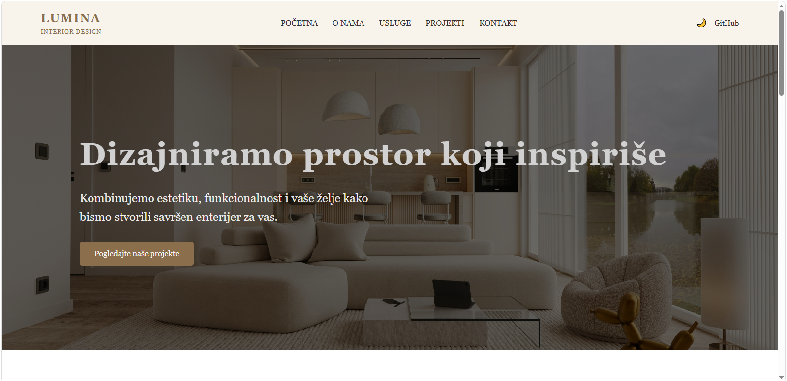

# Grupa12-TPTP-2026

# [Naziv]

# Tema: Web stranica kompanije za dizajn enterijera   

Ovo je projekat rađen za predmet Tehnologije za podršku tehničkom pisanju (TPTP). Web stranica predstavlja kompaniju za dizajn enterijera pod nazivom      .
Cilj projekta je prikaz usluga, projekata i načina rada firme kroz modernu i responzivnu web stranicu. Korisnici mogu pregledati različite tipove enterijera, filtrirati projekte, pogledati detalje, te putem kontakt forme poslati upit.
Aplikacija je izrađena koristeći HTML, CSS i JavaScript, bez korištenja dodatnih frameworka, uz implementaciju interaktivnih funkcionalnosti kao što su filtriranje sadržaja, tamni/svijetli mod i validacija forme.

---
##  Članovi tima

* **Amina Imamović** - *GitHub username: AminaImamovic * 
* **Amina Ibrahimović** - *GitHub username: aminaibrahimovic * 
* **Amina Fazlić** - *GitHub username: aminafazlic20  * 

##  Podjela rada

* **Amina Imamovic** - izrada index.html stranice i odgovarajuceg dijela koda za datu stranicu u CSS-u i JS-u
* **Amina Ibrahimovic** - izrada sadrzaj.html stranice i odgovarajuceg dijela koda za datu stranicu u CSS-u i JS-u
* **Amina Fazlic** - izrada kontakt.html stranice i odgovarajuceg dijela koda za datu stranicu u CSS-u i JS-u

##  Screenshot naslovne stranice

